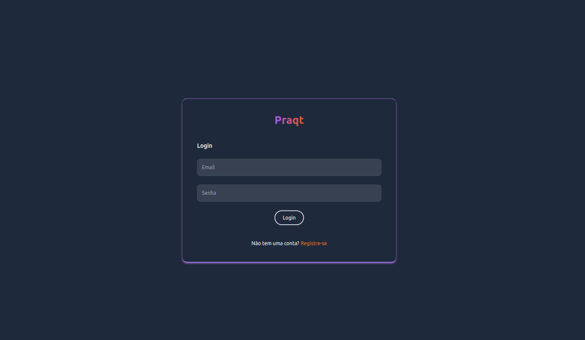

# Teste Engenheiro Junior



## Tecnologias utilizadas

- Laravel 11.x
- PHP 8.3
- MySQL 
- Livewire
- TailwindCSS

No meu projeto, decidi adotar a TALLStack, que representa uma abordagem moderna e eficiente para o desenvolvimento web com Laravel. A escolha do Livewire foi crucial para permitir a criação de interfaces dinâmicas e reativas diretamente do PHP, sem a necessidade de recorrer a grandes quantidades de JavaScript. Isso não só agiliza o processo de desenvolvimento, mas também mantém a aplicação mais coesa, com a lógica de front-end e back-end mais integradas.

Além disso, optei pelo TailwindCSS para a estilização da aplicação. Sua abordagem utility-first me permite construir interfaces de forma rápida e responsiva, sem a necessidade de escrever CSS personalizado do zero. Isso simplifica significativamente a manutenção do código de estilo, pois posso reutilizar classes utilitárias em toda a aplicação, garantindo consistência e eficiência no design.

## Como rodar o projeto:

### Instalação via Docker  

Faça uma cópia do arquivo .env.example e renomeie para .env.

`cp .env.example .env`

Mude o DB_CONNECTION, DB_HOST, DB_PORT, DB_DATABASE, DB_USERNAME, DB_PASSWORD para:

```
DB_CONNECTION=mysql
DB_HOST=mysql
DB_PORT=3306
DB_DATABASE=laravel
DB_USERNAME=laravel
DB_PASSWORD=password
```

Se necessário, conceda as permissões para as pastas storage e boostrap/cache:

`sudo chmod -R 777 storage && chmod -R 777 bootstrap/cache`


Rode o comando abaixo para executar os containers na raiz do projeto:

`docker compose up --build`

Com os containers up, abra outro terminal e execute os comandos abaixo para instalar as dependências e gerar as migrations e seeders:

`docker compose exec -it php bash`

`composer install`

`php artisan key:generate`

`php artisan migrate`

`php artisan db:seed`

Acesse o projeto com a URL localhost:8081/login

Você pode usar as credenciais para realizar o login:

Email:`test@example.com`  
Senha: `password`

Ou se preferir, crie uma conta.

Obrigada 💜


